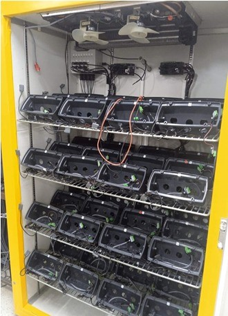
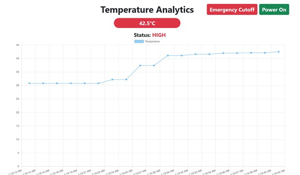
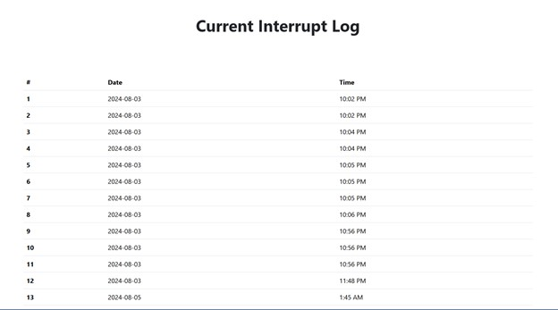

# Oven-Alert-System 🌡️⚡

Welcome to the **Oven-Alert-System** project! This is a web-based real-time temperature and power failure alert system for industrial test ovens, developed by [Salitha](https://github.com/salithaisuranga) and **Adheesha**. 

## Introduction 📚

In industrial and laboratory settings, maintaining precise temperature control in heating ovens is essential for ensuring product quality, safety, and operational efficiency. Overheating can lead to significant damage, safety hazards, and compromised product integrity, making it crucial to monitor temperature levels continuously. Traditional temperature monitoring systems often rely on manual checks and do not provide timely alerts or remote-control capabilities, which can be particularly problematic during off-hours or in critical situations.

The Heating Oven Alert System addresses these challenges by integrating a range of modern technologies to create a comprehensive monitoring and control solution. This system utilizes an ESP32 microcontroller, a real-time clock (RTC) module, a GSM module, a DHT11 sensor, relay modules, and a rechargeable battery with a charging module. The core functionality of the system includes real-time temperature monitoring, alert notifications via SMS and phone calls, and remote-control capabilities through a web interface.

## Objectives 🎯

- 📲 Send an alert message and call if the temperature exceeds 35°C.
- ⚠️ Accurately identify communication errors caused by power interruption.

## Apparatus 🛠️

- ESP32 microcontroller
- LM35 Temperature Sensor
- GSM Module
- RTC Module (DS 3231)
- Relay Module (One channel)
- Charging module
- Rechargeable battery (9V)
- Connecting Wires
- Breadboard
- 12V power supply
- 2 LEDs

## Problem Statement ❓

Maintaining a consistent and safe temperature within industrial ovens is crucial for ensuring product quality and safety. When temperatures exceed a specific threshold, immediate action is required to prevent potential damage or hazards. Traditional monitoring systems often rely on manual intervention and lack real-time alerts or remote-control capabilities. Additionally, power interruptions can lead to communication failures, complicating the diagnosis of such issues without effective logging. The current system fails to provide real-time monitoring and alerts for temperature deviations, lacks remote control functionality for emergency situations, does not log power interruptions for troubleshooting, and offers no user-friendly interface for managing the system remotely. These limitations jeopardize product quality, safety, and operational efficiency, highlighting the need for an integrated system that offers real-time monitoring, remote control, and comprehensive logging to address these critical challenges.

## Design Overview 🏗️

The Heating Oven Alert System is engineered to monitor and control oven temperatures in real-time while providing robust alert and logging capabilities. The design incorporates various components and technologies to achieve its objectives:

### Components and Functionality 🔧

- **ESP32 Microcontroller**: Acts as the central control unit, managing data from sensors, handling communication with the GSM module, and interfacing with the web server.
- **RTC Module**: Keeps track of real-time data and logs timestamps of power interruptions.
- **GSM Module**: Sends alert messages (SMS) and makes calls to notify the user when the temperature exceeds the set threshold.
- **DHT11 Sensor**: Measures temperature and humidity inside the oven.
- **Relay Modules**: Controls the power supply to the heating element based on temperature readings.
- **Rechargeable Battery with Charging Module**: Provides backup power to ensure continuous operation during power outages.

### Web Interface 🌐

- Developed using the Laravel framework, the web interface allows users to view real-time temperature data, access power interruption logs, and control the heating element remotely.
- Ngrok is used to securely expose the ESP32 data to the internet, enabling remote access to the web interface.

### Functionality Overview ⚙️

- **Temperature Monitoring**: Continuously checks the temperature against the set threshold (35°C).
- **Alert System**: Sends SMS and makes phone calls when the temperature exceeds the threshold.
- **Remote Control**: Allows users to cut off or power on the heater through the web interface.
- **Logging and Analysis**: Logs power interruptions and displays them on the web interface for analysis and troubleshooting.

## Actual Implementation Plan 📝

1. **Component Selection and Integration**:
    - **ESP32 Microcontroller**: Programmed to handle sensor data, communicate with the GSM module, and interact with the web server.
    - **RTC Module**: Connected to the ESP32 via I2C for accurate timekeeping and logging.
    - **GSM Module**: Configured to send SMS and make calls, integrated with the ESP32 for alert functionality.
    - **DHT11 Sensor**: Wired to the ESP32 for temperature and humidity readings.
    - **Relay Modules**: Controlled by the ESP32 to manage the heating element.
    - **Rechargeable Battery**: Integrated with a charging module to ensure backup power.

2. **Software Development**:
    - **Firmware Development**: Coded the ESP32 firmware to handle sensor readings, alerting, and logging. Implemented routines for temperature monitoring, alert generation, and power interruption logging.
    - **Web Interface Development**: Built the web interface using the Laravel framework. Defined routes for temperature analytics, power interruption logs, and heater control. Implemented real-time data visualization using JavaScript and Chart.js.
    - **Ngrok Integration**: Configured ngrok to securely expose the ESP32 data to the internet and facilitate remote access to the web interface.

3. **Testing and Debugging**:
    - Conducted tests to verify the accuracy of temperature readings, the functionality of alert notifications, and the reliability of remote-control features.
    - Debugged issues related to sensor data accuracy, GSM communication, and web interface responsiveness.

4. **Deployment**:
    - Assembled the hardware components on a PCB and integrated them into the final enclosure.
    - Deployed the web interface to a live server and ensured that all components were properly connected and operational.

## Final Implementation 🚀

The final implementation of the Heating Oven Alert System includes the following key features and components:

### Hardware Setup 🖥️

- **ESP32 Microcontroller**: Mounted on a PCB and connected to the RTC module, GSM module, DHT11 sensor, and relay modules.
- **RTC Module**: Properly interfaced with the ESP32 for accurate timekeeping and logging.
- **GSM Module**: Configured for sending SMS alerts and making phone calls.
- **DHT11 Sensor**: Placed in the oven to monitor temperature and humidity.
- **Relay Modules**: Connected to the heating element for on/off control.
- **Rechargeable Battery**: Integrated with a charging module to provide backup power during interruptions.

### Web Interface 🌐

- **Real-Time Temperature Plot**: Displays live temperature data using Chart.js.
- **Remote Heater Control**: Provides buttons for emergency cutoff and power-on operations.
- **Power Interruption Log**: Shows logged power interruption times for analysis.
- **Secure Access**: Utilizes ngrok for secure online access to the web interface.

### System Operation ⚙️

- The system continuously monitors the temperature of the oven. When the temperature exceeds 35°C, the ESP32 triggers the GSM module to send an SMS and make a phone call.
- Users can log into the web interface from anywhere to view real-time temperature data, control the heater, and review power interruption logs.
- The RTC module logs power interruptions, which are displayed on the web interface for further analysis and comparison with communication failure logs from the oven system.

### Performance Evaluation 📊

- The system has been tested for accuracy in temperature monitoring, reliability in alert notifications, and effectiveness in remote control and logging.
- All components are functioning as expected, providing a robust solution for monitoring and controlling the heating oven with real-time alerts and remote access capabilities.

## Conclusion 🏁

The Heating Oven Alert System has effectively addressed key challenges in industrial temperature management by integrating advanced technologies for real-time monitoring, alerting, and remote control. Through the use of an ESP32 microcontroller, GSM module, DHT11 sensor, RTC module, and a user-friendly web interface developed with Laravel, the system ensures prompt detection of temperature anomalies, immediate notifications via SMS and phone calls, and remote heater control from any location. The inclusion of ngrok for secure online access and comprehensive logging capabilities further enhances the system's functionality, allowing for accurate tracking of power interruptions and effective diagnosis of communication failures. Overall, the successful implementation of this system represents a significant improvement over traditional methods, providing enhanced safety, convenience, and efficiency in managing heating ovens.
